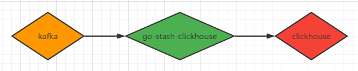

[English](readme.md) | 简体中文

# go-stash-clickhouse简介

go-stash是一个高效的从Kafka获取，根据配置的规则进行处理，然后发送到Clickhouse集群的工具。




### 安装

```shell
cd stash && go build stash.go
```

### Quick Start

- 可执行文件方式

```shell
./stash -f etc/config.yaml
```

config.yaml示例如下:

```yaml
Clusters:
- Input:
    Kafka:
      Name: go-stash
      Log:
        Mode: file
      Brokers:
      - "172.16.48.41:9092"
      - "172.16.48.42:9092"
      - "172.16.48.43:9092"
      Topic: ngapplog
      Group: stash
      Conns: 3
      Consumers: 10
      Processors: 60
      MinBytes: 1048576
      MaxBytes: 10485760
      Offset: first
  Filters:
  - Action: drop
    Conditions:
      - Key: status
        Value: 503
        Type: contains
      - Key: type
        Value: "app"
        Type: match
        Op: and
  - Action: remove_field
    Fields:
    - message
    - source
    - beat
    - fields
    - input_type
    - offset
    - "@version"
    - _score
    - _type
    - clientip
    - http_host
    - request_time
  Output:
    Clickhouse:
      Addr:
        - "127.0.0.1:9000"
      Auth:
        Database: default
        Username: default
        Password:
      Table: example
      Columns:
        - Col1
        - Col2
        - Col3
```

## 详细说明

### input

```shell
Conns: 3
Consumers: 10
Processors: 60
MinBytes: 1048576
MaxBytes: 10485760
Offset: first
```
#### Conns
  链接kafka的链接数，链接数依据cpu的核数，一般<= CPU的核数；

#### Consumers
  每个连接数打开的线程数，计算规则为Conns * Consumers，不建议超过分片总数，比如topic分片为30，Conns *Consumers <= 30

#### Processors
  处理数据的线程数量，依据CPU的核数，可以适当增加，建议配置：Conns * Consumers * 2 或 Conns * Consumers * 3，例如：60  或 90

#### MinBytes MaxBytes
  每次从kafka获取数据块的区间大小，默认为1M~10M，网络和IO较好的情况下，可以适当调高

#### Offset
  可选last和false，默认为last，表示从头从kafka开始读取数据


### Filters

```shell
- Action: drop
  Conditions:
    - Key: k8s_container_name
      Value: "-rpc"
      Type: contains
    - Key: level
      Value: info
      Type: match
      Op: and
- Action: remove_field
  Fields:
    - message
    - _source
    - _type
    - _score
    - _id
    - "@version"
    - topic
    - index
    - beat
    - docker_container
    - offset
    - prospector
    - source
    - stream
- Action: transfer
  Field: message
  Target: data

```
#### - Action: drop
  - 删除标识：满足此条件的数据，在处理时将被移除，不进入es
  - 按照删除条件，指定key字段及Value的值，Type字段可选contains(包含)或match(匹配)
  - 拼接条件Op: and，也可写or

#### - Action: remove_field
  移除字段标识：需要移除的字段，在下面列出即可

#### - Action: transfer
  转移字段标识：例如可以将message字段，重新定义为data字段


### Output

#### Columns
  可选，表需要写入的字段

#### MaxChunkBytes
  每次提交的bulk大小，默认是15M

### GracePeriod
  默认为15s，在程序关闭后，在15s内用于处理余下的消费和数据，优雅退出

### 支持类型
 - [x] Float32, Float64
 - [x] Int8, Int16, Int32, Int64
 - [x] UInt8, UInt16, UInt32, UInt64
 - [x] IPv4, IPv6
 - [x] Bool, Boolean
 - [x] Date, Date32, DateTime
 - [x] UUID
 - [x] String

### 参考
 - [https://github.com/kevwan/go-stash](https://github.com/kevwan/go-stash)